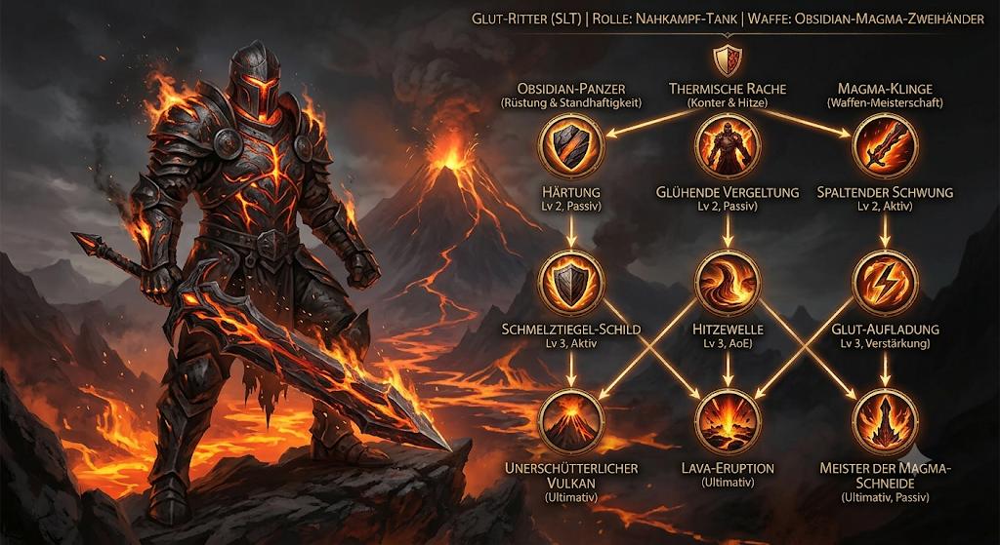

# Glut-Ritter

## Charakter-Übersicht

| | |
| --- | --- |
| **Seltenheit** | Selten (SLT) |
| **Rolle** | Nahkampf-Tank |
| **Waffe** | Obsidian-Magma-Zweihänder |
| **Fokus** | Hohe Rüstung & Gegenangriffe durch Hitzeschaden |

## Sprecher-Skript: Helden-Spotlight

### Intro

> "Eine unerschütterliche Bastion aus Obsidian und schmelzendem Gestein: Der
> Glut-Ritter steht an vorderster Front. Je härter die Gegner ihn treffen,
> desto heißer brennt seine Rache."

### Zweig 1: Obsidian-Panzer (Rüstung & Standhaftigkeit)

- **Härtung** (Passiv, Lv 2) – Erhöht die Rüstung prozentual basierend auf der
  bereits erlittenen Schadensmenge.
- **Schmelztiegel-Schild** (Aktive Fähigkeit, Lv 3) – Erzeugt einen Schild aus
  gehärtetem Obsidian. Solange der Schild aktiv ist, verlangsamt er die
  Angriffsgeschwindigkeit nahestehender Feinde.
- **Unerschütterlicher Vulkan** (Ultimative Fähigkeit) – Verankert den Ritter am
  Boden. Gewährt zeitweise Immunität gegen Betäubungen und reduziert jeglichen
  erlittenen Schaden drastisch.

### Zweig 2: Thermische Rache (Gegenangriff & Hitze)

- **Glühende Vergeltung** (Passiv, Lv 2) – Jeder erhaltene Nahkampftreffer
  reflektiert prozentualen Hitzeschaden direkt auf den Angreifer zurück.
- **Hitzewelle** (AoE-Schwächung, Lv 3) – Stößt eine Hitzewelle aus den
  Rüstungsspalten aus, die die Rüstung umliegender Gegner schmilzt und
  Brand-Debuffs aufträgt.
- **Lava-Eruption** (Ultimative Fähigkeit) – Absorbiert den in den letzten
  4 Sekunden erlittenen Schaden und entlädt ihn in einer verheerenden
  Magma-Explosion im direkten Umkreis.

### Zweig 3: Magma-Klinge (Waffen-Meisterschaft)

- **Spaltender Schwung** (Nahkampf, Lv 2) – Ein weiter Schlag mit dem
  Zweihänder, der eine brennende Schneise auf dem Boden hinterlässt.
- **Glut-Aufladung** (Verstärkung, Lv 3) – Überzieht die Klinge mit flüssiger
  Lava. Der nächste Angriff durchbricht gegnerische Schilde und verursacht
  erhöhten Flächenschaden.
- **Meister der Magma-Schneide** (Ultimative Meisterschaft) – Jeder erlittene
  Treffer erhöht das eigene Angriffstempo und verstärkt den reflektierten
  Hitzeschaden.

### Gameplay-Tipp

Platziert den Glut-Ritter mitten in der gegnerischen Ansammlung. Aktiviert den
Schmelztiegel-Schild, absorbiert den ersten Ansturm und entladet die
gesammelte Energie mit Lava-Eruption für maximalen Konterschaden.
