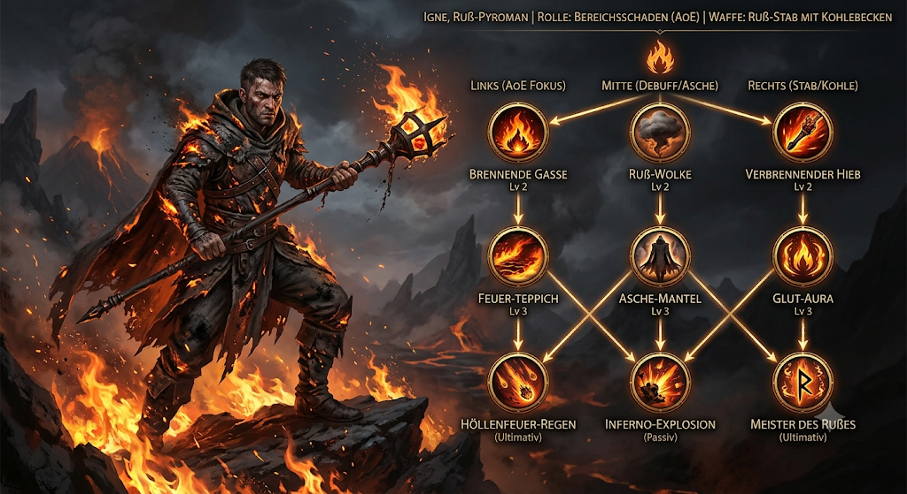

# Igne – Der Ruß-Pyroman

## Charakter-Übersicht

| | |
| --- | --- |
| **Seltenheit** | Gewöhnlich (GWN) |
| **Rolle** | Bereichsschaden (AoE) |
| **Waffe** | Ruß-Stab mit glühendem Kohlebecken |
| **Fokus** | Brand-Debuffs, Flächenfeuer & Schlachtfeldkontrolle |

## Sprecher-Skript: Helden-Spotlight

### Intro

> "Wenn der Rauch aufsteigt, folgt Igne nicht dem Feuer – er ist die Asche,
> die alles verschlingt. Ausgerüstet mit seinem schweren Ruß-Stab zündet
> dieser AoE-Spezialist ganze Feindwellen an und schwächt alles, was im
> Funkenflug überlebt."

### Zweig 1: Flächenfeuer (AoE-Schaden)

- **Brennende Gasse** (Aktive Fähigkeit, Lv 2) – Igne zieht eine Flammenlinie
  über den Boden. Gegner, die sie kreuzen, erleiden direkten Feuerschaden und
  fangen Feuer.
- **Feuer-Teppich** (Flächenschaden, Lv 3) – Verwandelt eine Zielzone in ein
  loderndes Flammenmeer. Fügt allen Einheiten im Bereich kontinuierlichen
  Schaden pro Sekunde zu.
- **Höllenfeuer-Regen** (Ultimative Fähigkeit) – Beschwört einen verheerenden
  Asche- und Glutregen auf ein großes Areal. Richtet über mehrere Sekunden
  enormen Flächenschaden an.

### Zweig 2: Rauch & Kontrolle (Debuff-Fokus)

- **Ruß-Wolke** (Debuff, Lv 2) – Schleudert eine dichte Rauchwolke ins
  Zielgebiet. Blendet Feinde, senkt deren Trefferchance und verringert ihr
  Bewegungstempo.
- **Asche-Mantel** (Defensiv, Lv 3) – Umhüllt Igne mit einer Schicht aus
  glühender Kohle. Absorbiert eingehenden Schaden und fügt Angreifern im
  Nahkampf Feuerschaden zu.
- **Inferno-Explosion** (Passive Fähigkeit) – Gegner, die unter Brand-Effekten
  leiden und sterben, detonieren in einer Aschewolke und übertragen die
  Brand-Debuffs auf umstehende Feinde.

### Zweig 3: Stab & Glut (Waffen-Meisterschaft)

- **Verbrennender Hieb** (Nahkampf, Lv 2) – Ein wuchtiger Schlag mit dem
  Kohlebecken des Stabs. Verursacht physischen Schaden und betäubt das Ziel
  kurzzeitig.
- **Glut-Aura** (Aura, Lv 3) – Strahlt Hitze aus, die den Feuerschaden aller
  Verbündeten im Umkreis erhöht und gegnerischen Rüstungsschutz durch Hitze
  schmelzen lässt.
- **Meister des Rußes** (Ultimative Meisterschaft) – Verdoppelt die Dauer aller
  aktiven Brand-Debuffs auf dem Schlachtfeld und gewährt kritischen
  Zusatzschaden gegen brennende Ziele.

### Gameplay-Tipp

Kombiniert die Ruß-Wolke, um Gegner auf einem Fleck zu sammeln, zündet den
Feuer-Teppich direkt darunter und lasst die Inferno-Explosion für
Kettenreaktionen sorgen.
