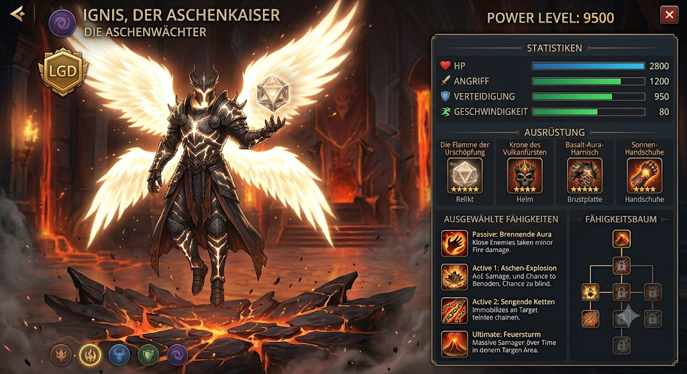

# Ignis, Der Aschenkaiser

## Charakter-Übersicht

| | |
| --- | --- |
| **Fraktion** | Die Aschenwächter |
| **Seltenheit** | Legendär (LGD) |
| **Rolle** | Magischer Carry |
| **Waffe** | Die Flamme der Urschöpfung |
| **Power Level** | 9500 |

## Werte

| Wert | |
| --- | --- |
| HP | 2800 |
| Angriff | 1200 |
| Verteidigung | 950 |
| Geschwindigkeit | 80 |

## Ausrüstung

| Slot | Gegenstand | Bonus |
| --- | --- | --- |
| Waffe | Die Flamme der Urschöpfung | +450 Angriff, +15 % Krit-Chance |
| Helm | Krone des Vulkanfürsten | +600 HP, +100 Verteidigung |
| Brustplatte | Basalt-Aura-Harnisch | +350 Verteidigung, +400 HP |
| Handschuhe | Sonnen-Handschuhe | +20 Geschwindigkeit, +150 Angriff |

## Fähigkeiten

| Slot | Fähigkeit | Abklingzeit | Wirkung |
| --- | --- | --- | --- |
| Passiv | **Ur-Hitze** | – | Wandelt 20 % des erlittenen Schadens in einen Schutzschild um und fügt allen Umstehenden 200 DPS Feuerschaden zu. |
| Aktiv 1 | **Magma-Kompression** | 3 Runden | Fügt einem Einzelziel 1800 Magieschaden zu und verringert dessen Rüstung 3 Runden lang um 40 %. |
| Aktiv 2 | **Vulkanausbruch** | 4 Runden | Erzeugt ein schmelzendes Magmafeld für 800 AoE-Schaden und verlangsamt betroffene Feinde um 50 %. |
| Ultimativ | **Kataklysmus** | 7 Runden | Vernichtende Feuer-Explosion: Fügt allen Feinden 3500 Schaden zu und hinterlässt 6 Runden lang brennenden Zonen-Schaden. |

## Optik

- **Pose** – Schwebt berührungslos über schmelzendem Obsidianboden.
- **Rüstung** – Schwebende Basaltplatten, zusammengehalten von weißgoldener
  Magma-Aura.
- **Flügel** – Vier Flügel aus reiner, gleißender Urflamme.
- **Waffe** – Die Flamme der Urschöpfung (rotierendes Kristall-Oktaeder).
- **Hintergrund** – Vulkanischer Thronsaal mit schmelzendem Glasboden.

## Offen

- **Bild und Daten weichen ab.** Die Heldenkarte zeigt vier andere
  Fähigkeitsnamen: Brennende Aura, Aschen-Explosion, Sengende Ketten und
  Feuersturm. Übernommen sind die Namen aus den Daten (Ur-Hitze,
  Magma-Kompression, Vulkanausbruch, Kataklysmus), weil dort auch alle Werte
  stehen. Welche Fassung gilt, ist noch zu klaeren.
- **Kein Sprecher-Skript.** Igne und der Glut-Ritter haben ein Intro und einen
  Gameplay-Tipp, Ignis noch nicht.
- **Der Fähigkeitsbaum auf der Karte ist unbelegt.** Die Karte zeigt ein
  Baumfeld mit gesperrten Knoten, aber keine Zuordnung zu den vier
  Fähigkeiten.
